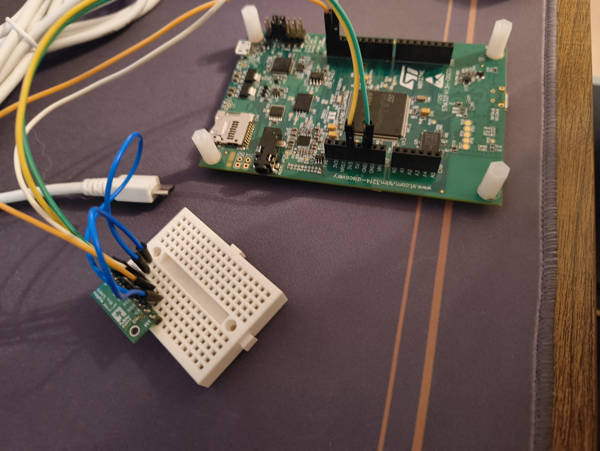

# ApBDC — STM32 Wi-Fi Magnetometer Compass

A bare-metal embedded project for the **STM32F413H Discovery** board that reads a 3-axis magnetic field sensor, computes a heading angle, and streams it over Wi-Fi to a lightweight Python HTTP server. The server renders a live compass in any web browser.

**Authors:** Denys Shevchenko & Yehor Karabanov

---



---

## Table of Contents

1. [How It Works](#how-it-works)
2. [Hardware Required](#hardware-required)
3. [Wiring / Pin Connections](#wiring--pin-connections)
4. [Repository Structure](#repository-structure)
5. [Running the Python Server](#running-the-python-server)
6. [Building and Flashing the Firmware (Eclipse)](#building-and-flashing-the-firmware-eclipse)
7. [Configuration](#configuration)
8. [Architecture Notes](#architecture-notes)

---

## How It Works

```
LIS3MDL sensor
     |
     | I2C2 + DMA (PB10 SCL / PB11 SDA)
     v
STM32F413H Discovery
     |
     | TIM2 triggers a 20 Hz DMA read → circular buffer
     | TIM3 fires every 500 ms → HTTP POST
     |
     | Wi-Fi (ISM43362 module, on-board)
     v
Python FastAPI server  (POST /data)
     |
     v
Browser  →  GET /  →  live compass page (AJAX polling at 200 ms)
```

The firmware runs fully interrupt-driven: TIM2 initiates a non-blocking I2C DMA read of the LIS3MDL every 50 ms, and TIM3 wakes the CPU every 500 ms to POST the latest heading to the server. Between interrupts the CPU sleeps with `WFI`.

---

## Hardware Required

| Component | Details |
|---|---|
| STM32F413H Discovery board | Includes ISM43362 Wi-Fi module and LIS3MDL magnetometer header |
| LIS3MDL breakout board | 3-axis magnetometer (SA1 pin to GND → I2C address 0x1C) |
| Breadboard + jumper wires | 4 wires: VCC, GND, SCL, SDA |
| Micro-USB cable | Power and ST-LINK debug connection |
| PC / laptop | Running the Python server, on the same Wi-Fi network |

---

## Wiring / Pin Connections

Connect the LIS3MDL breakout to the Discovery board's Arduino-compatible header:

| LIS3MDL Pin | STM32F413H Discovery Pin | Board Label | Notes |
|---|---|---|---|
| VCC | 3.3 V | 3V3 | Do not use 5 V |
| GND | GND | GND | Common ground |
| SCL | PB10 | ARD_D15_SCL | I2C2 SCL (AF4) |
| SDA | PB11 | ARD_D14_SDA | I2C2 SDA (AF4) |
| SA1 | GND | GND | Sets I2C address to 0x1C |
| INT | not connected | — | Optional, not used |

> The I2C bus runs at 100 kHz standard mode. Both SCL and SDA lines are configured as open-drain with no pull-up resistors in software — ensure your LIS3MDL breakout has on-board pull-ups (most do).

---

## Repository Structure

```
ApBDC/
├── src/
│   ├── main.cpp                     # Application entry point
│   ├── sensor/
│   │   ├── i2c_dma.c                # I2C2 + DMA1 driver
│   │   ├── lis3mdl.c                # LIS3MDL magnetometer driver
│   │   └── magnetometer_stream.c   # TIM2-driven circular-buffer streaming
│   └── wifi/
│       └── wifi.c                   # Wi-Fi init + HTTP POST helpers
├── include/
│   ├── sensor/                      # Sensor driver headers
│   ├── wifi/
│   │   └── wifi_conf.hpp            # SSID, password, server IP/port
│   └── http_client.h                # HTTP POST request template
├── server/
│   ├── server.py                    # FastAPI server (POST /data, GET /)
│   └── pyproject.toml               # Python project metadata (uv)
├── ldscripts/                       # Linker scripts (mem.ld, sections.ld)
├── system/                          # CMSIS, HAL, startup code
└── drivers/                         # ISM43362 Wi-Fi driver
```

---

## Running the Python Server

### Prerequisites

- Python 3.12 or newer
- [`uv`](https://github.com/astral-sh/uv) package manager  
  Install with: `curl -LsSf https://astral.sh/uv/install.sh | sh`

### Steps

1. **Find your machine's IP address** on the Wi-Fi network the STM32 will connect to.  
   On Linux/macOS: `ip addr` or `ifconfig`  
   On Windows: `ipconfig`

2. **Open `include/wifi/wifi_conf.hpp`** and update `SERVER_IP_BYTES` to match (see [Configuration](#configuration)).

3. **Start the server** from the `server/` directory:

   ```bash
   cd server
   uv run uvicorn server:app --host 0.0.0.0 --port 5000
   ```

   Or, using the built-in entry point:

   ```bash
   cd server
   uv run server.py
   ```

4. **Open a browser** and navigate to `http://localhost:5000` (or the server's IP from another device). The page will show "Waiting for data from STM32..." until the board connects and starts posting.

The server exposes three endpoints:

| Method | Path | Purpose |
|---|---|---|
| GET | `/` | Live compass HTML page |
| GET | `/api/data` | Current heading as JSON (used by the page's AJAX polling) |
| POST | `/data` | Receive `degree=<float>` from the STM32 |

---

## Building and Flashing the Firmware (Eclipse)

### Prerequisites

- [Eclipse IDE for Embedded C/C++ Developers](https://www.eclipse.org/downloads/packages/)
- [xPack GNU Arm Embedded GCC](https://github.com/xpack-binaries/arm-none-eabi-gcc/releases) (arm-none-eabi-gcc)
- ST-LINK drivers and a compatible debug probe (the Discovery board has one built in)
- OpenOCD or STM32CubeProgrammer for flashing

### Steps

1. **Clone the repository:**

   ```bash
   git clone https://github.com/LilConsul/ApBDC.git
   ```

2. **Import the project into Eclipse:**
   - `File` → `Open Projects from File System...`
   - Select the repository root folder (`ApBDC/`)
   - Eclipse detects the `.project` / `.cproject` files automatically
   - Click `Finish`

3. **Configure Wi-Fi credentials and server address**  
   Edit [`include/wifi/wifi_conf.hpp`](include/wifi/wifi_conf.hpp) before building (see [Configuration](#configuration)).

4. **Select the build configuration:**
   - `Project` → `Build Configurations` → `Set Active` → `Debug` (for development) or `Release` (for deployment)

5. **Build the project:**
   - `Project` → `Build Project` (or `Ctrl+B`)
   - The ELF, binary, and HEX files are generated in the `Debug/` or `Release/` folder

6. **Connect the board:**
   - Plug the Discovery board into USB. This powers the board and connects the on-board ST-LINK debugger.

7. **Flash and debug:**
   - `Run` → `Debug Configurations...`
   - Select your GDB / OpenOCD configuration and click `Debug`
   - Alternatively, use STM32CubeProgrammer to flash `ApBDC.hex` directly

8. **Observe trace output:**  
   In Debug build, `trace_printf()` messages are routed to the semihosting console in Eclipse. You will see the Wi-Fi connection progress and each HTTP POST confirmation:

   ```
   ================================
     STM32F413H WiFi HTTP Client
   ================================
   Step 1: Initializing magnetometer...
     -> Magnetometer initialized

   Step 2: Initializing WiFi module...
   Step 3: Connecting to network 'YourSSID'...
     -> Connected to WiFi network
   ...
   [SEND] Heading: 274.3 deg -> 192.168.0.53:5000
   [SEND] OK (128 bytes)
   ```

   Once `[SEND] OK` appears, the compass page in the browser will start updating.

---

## Configuration

All user-facing settings live in [`include/wifi/wifi_conf.hpp`](include/wifi/wifi_conf.hpp):

```cpp
// Wi-Fi network credentials
#define WIFI_SSID     "YourNetworkName"
#define WIFI_PASSWORD "YourPassword"

// IP address of the machine running server/server.py
#define SERVER_IP_BYTES  { 192, 168, 0, 53 }
#define SERVER_PORT      5000
#define SERVER_ENDPOINT  "/data"

// How often the STM32 POSTs a heading update (milliseconds)
#define HTTP_SEND_INTERVAL_MS  500
```

Change `SERVER_IP_BYTES` to the actual IP of your server machine. Both the STM32 and the server must be on the same network.

---

## Architecture Notes

### Interrupt-driven sensor pipeline

- **TIM2** fires every 50 ms (20 Hz). Its ISR calls `Magnetometer_TimerCallback()`, which starts an I2C2 DMA read of 6 bytes (X/Y/Z raw values) from the LIS3MDL register `0x28` with auto-increment.
- When the DMA transfer completes, `HAL_I2C_MemRxCpltCallback()` converts the raw values to gauss and stores the sample in a 32-entry circular buffer.
- The main loop reads the latest sample from the buffer only when TIM3 fires (every 500 ms), computes the heading with an `atan2` approximation, and POSTs it over TCP.
- Between events the CPU executes `WFI` (Wait For Interrupt), keeping power consumption low.

### Heading calculation

The heading is computed from the X and Y magnetic field components:

```
heading = atan2(y, x) * 180 / PI
if heading < 0: heading += 360
```

This gives degrees clockwise from magnetic north (0 = North, 90 = East, 180 = South, 270 = West). No tilt compensation is applied; keep the board reasonably level for accurate readings.

### Wi-Fi transport

The firmware uses the on-board ISM43362 module via SPI. Each HTTP POST opens a TCP connection to the server, sends the request, and immediately closes the connection. There is no persistent connection or TLS.
